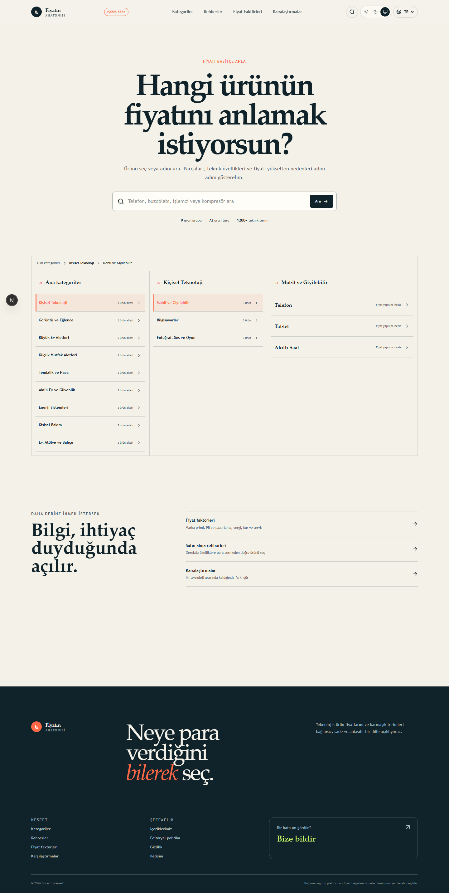

# Fiyatın Anatomisi

Fiyatın Anatomisi, evde kullandığımız teknolojik ürünlerin neden farklı fiyatlara satıldığını sade bir dille anlatan bir içerik projesi. Telefonun işlemcisinden buzdolabının kompresörüne, monitör panelinden saç kurutma makinesinin rezistansına kadar ürünü oluşturan parçaları; bunların faydalarını, sınırlarını ve fiyata etkilerini açıklar.

Karşılaştırma araçları projenin ana amacı değil. Öncelik, kullanıcının etiketteki rakamın arkasında ne olduğunu anlayabilmesi ve ihtiyacı olmayan bir özelliğe fazladan para vermemesidir.



## Projede neler var?

- 9 ana ürün grubu ve 88 ayrıntılı ürün kategorisi
- Telefon, kamera, bilgisayar, donanım, aksesuar, monitör, beyaz eşya, küçük ev aletleri, kişisel bakım, akıllı ev ve daha fazlası
- 1.400'den fazla teknik terim
- Her terim için basit açıklama, fiyat etkisi, artılar, eksiler ve kullanıcıya uygunluk notu
- Marka primi, reklam, PR, dağıtım, vergi, kur, servis ve garanti gibi ürün dışı fiyat etkenleri
- Üç seviyeli kategori gezgini: ana kategori, ürün ailesi ve ürün
- Açık, koyu ve sistem teması
- Türkçe içerik ile Türkçe ve İngilizce arayüz

İngilizce arayüz hazırdır. Veritabanındaki editoryal makaleler şu an Türkçe kaynak metne geri döner; bu içerikler doğrulanmış İngilizce karşılıkları hazırlandıkça ayrı dil kayıtları olarak yayımlanmalıdır.

## Yerel kurulum

Node.js 20 veya 22 kullanın. Ardından:

```bash
npm install
```

`.env.example` dosyasını `.env` olarak kopyalayın ve yerel SQLite adresini tanımlayın:

```env
DATABASE_URL="file:./dev.db"
```

Veritabanını hazırlayıp projeyi başlatın:

```bash
npx prisma migrate deploy
npm run db:seed
npm run dev
```

Uygulama varsayılan olarak `http://localhost:3000/tr` adresinde açılır. İngilizce arayüz için `/en` yolunu kullanabilirsiniz.

## Geliştirme komutları

```bash
npm test          # Vitest birim ve bileşen testleri
npm run lint      # ESLint kontrolü
npm run build     # Production derlemesi
npm run test:e2e  # Derleme ve Playwright tarayıcı testleri
npm run db:seed   # Başlangıç içeriğini yeniden oluşturur
```

Playwright ilk kez kullanılacaksa Chromium kurulmalıdır:

```bash
npx playwright install chromium
```

## Kullanılan yapı

Proje JavaScript ve JSX ile yazılmıştır. Arayüz Next.js 16 App Router, React 19 ve Tailwind CSS 4 üzerinde çalışır. İçerik modeli Prisma 5 ile yönetilir; yerel geliştirmede SQLite kullanılır. Rotalar ve arayüz metinleri `next-intl`, testler Vitest, Testing Library ve Playwright ile hazırlanmıştır.

Temel dizinler:

```text
src/app/             Sayfalar ve rota düzeni
src/components/      Arayüz, katalog ve görsel anlatım bileşenleri
src/lib/             İçerik sorguları, kategori ağacı ve çeviri metinleri
prisma/              Şema, migration dosyaları ve başlangıç verisi
i18n/                next-intl mesajları
tests/               Uçtan uca testler
docs/                Tasarım notları ve proje ekran görüntüleri
```

## Editoryal not

Fiyat etki puanları kesin maliyet yüzdesi değildir. Marka primi ve pazarlama gibi ölçülmesi zor başlıklar, kullanıcıya fiyatın katmanlarını göstermek için hazırlanmış editoryal değerlendirmelerdir.

Başlangıç verisindeki içerikler editoryal beta durumundadır. Teknik iddialar yayıma hazır kabul edilmeden önce üretici belgeleri, standart dokümanları veya güvenilir birincil kaynaklarla terim bazında eşleştirilmelidir. Özellikle güvenlik, enerji tüketimi ve dayanıklılık bilgileri ürün türüne göre ayrıca kontrol edilmelidir.

Yerel `.env` dosyaları Git tarafından izlenmez. Gerçek anahtarlar, bağlantı bilgileri veya kişisel veriler kaynak koda eklenmemelidir.
